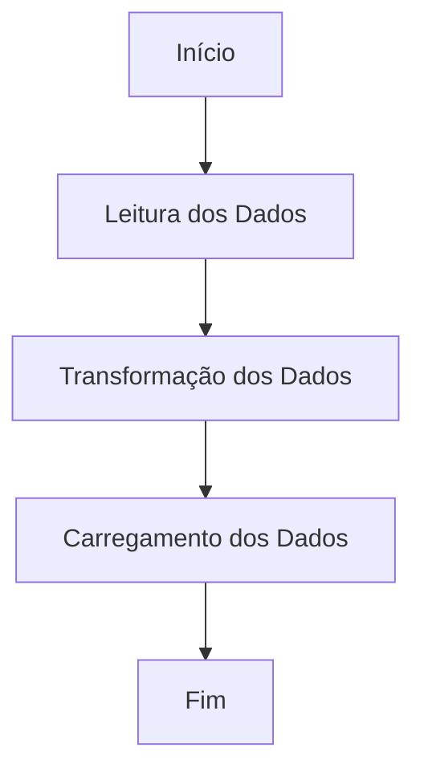

# Aula 04 - Bootcamp de Python com Laennder  

## Processo ETL Detalhado  

### Diagrama Geral do Processo ETL  



---

### **Extrair: Leitura dos Dados**  

```mermaid
subgraph Extrair[Etapa de Extração]
    A1[Ler arquivo CSV] --> A2[Gerar DataFrame com Pandas]
    A2 --> A3[Verificar Tipos de Dados]
    A3 --> A4[Verificar Valores Nulos]
end
```

---

### **Transformar: Limpeza e Manipulação dos Dados**  

```mermaid
subgraph Transformar[Etapa de Transformação]
    B1[Remover Duplicatas] --> B2[Preencher Valores Nulos]
    B2 --> B3[Adicionar Coluna 'Mês']
    B3 --> B4[Calcular Total de Vendas por Produto]
end
```

---

### **Carregar: Exportar os Dados**  

```mermaid
subgraph Carregar[Etapa de Carregamento]
    C1[Preparar Dados Processados] --> C2[Salvar em CSV Processado]
    C2 --> C3[Salvar em Arquivo Parquet]
    C3 --> C4[Preparar para Integração com AWS S3]
end
```

---

## Objetivos da Aula  

Nesta aula, o foco está em:

1. **Criar uma ETL (Extract, Transform, Load) completa usando Pandas**:
   - Extração de dados de um arquivo CSV para um DataFrame
   - Transformação e limpeza, incluindo:
     - Remoção de duplicatas  
     - Tratamento de valores nulos  
     - Adição de uma coluna com o mês da venda  
     - Cálculo do total de vendas por produto  
   - Carregamento dos dados em:
     - Um novo arquivo CSV  
     - Um arquivo **Parquet** para garantir eficiência na leitura/escrita  

2. **Preparar o projeto para futura integração com AWS S3**:  
   - Armazenamento dos arquivos CSV e Parquet na nuvem  
   - Automação de pipelines com cloud computing  

3. **Revisar conceitos de Git e GitHub**:
   - Versionamento de código e controle de mudanças  
   - Colaboração eficiente através de repositórios no GitHub  

---

## Estrutura do Projeto  

```
projeto_etl/
│
├── data/
│ ├── input/
│ │ └── vendas.csv
│ └── output/
│     ├── vendas_processadas.csv
│     └── vendas_processadas.parquet
│
├── src/
│ └── etl_process.py
│
├── test/
│ └── test_etl_process.py
│
└── README.md
```

---

## Como Instalar e Executar o Projeto  

1. **Verificar dependências**  
   Certifique-se de ter **Python 3.12+** e **Git** instalados:

   ```bash
   python --version
   git --version
   ```

2. **Clonar o repositório**  

   ```bash
   git clone https://github.com/lvgalvao/projeto_etl.git
   cd projeto_etl
   ```

3. **Criar e ativar um ambiente virtual**:  

   **Windows:**
   ```bash
   python -m venv .venv
   source .venv\Scripts\activate
   ```

   **macOS/Linux:**
   ```bash
   python -m venv .venv
   source .venv/bin/activate
   ```

4. **Instalar as dependências**:  

   ```bash
   pip install -r requirements.txt
   ```

5. **Executar o processo ETL**:  

   Navegue até a pasta `src` e rode o script:

   ```bash
   cd src
   python etl_process.py
   ```

   O script salvará os dados processados nos formatos **CSV** e **Parquet** na pasta `data/output`.

---

## Bibliotecas Utilizadas  

1. **Pandas**  
   - Manipulação de dados tabulares em Python.  
   - Facilita a leitura e escrita de arquivos CSV e Parquet, além de fornecer operações eficientes para limpeza e transformação dos dados.

   **Instalação:**  
   ```bash
   pip install pandas
   ```

2. **PyArrow**  
   - Suporta a conversão e manipulação de arquivos no formato **Parquet**, garantindo eficiência em I/O.  
   - Usado em conjunto com Pandas para leitura e escrita de arquivos Parquet.

   **Instalação:**  
   ```bash
   pip install pyarrow
   ```

3. **pytest**  
   - Ferramenta para executar **testes unitários**, essencial para garantir que o código esteja funcionando como esperado.  
   - Utilizamos pytest para validar:
     - A extração correta dos dados
     - A transformação adequada, como preenchimento de valores nulos e cálculo de vendas
     - O carregamento dos dados tanto em CSV quanto em Parquet

   **Instalação:**  
   ```bash
   pip install pytest
   ```

---

## Testes Unitários  

1. **Objetivo do pytest**:  
   Garantir que o código ETL funcione conforme o esperado e que futuras alterações não introduzam erros. Os testes cobrem:  
   - Extração correta dos dados do CSV  
   - Transformação dos dados com remoção de duplicatas e preenchimento de valores nulos  
   - Exportação correta para **CSV** e **Parquet**  

2. **Como rodar os testes**:  
   Certifique-se de estar na pasta raiz do projeto e execute:

   ```bash
   PYTHONPATH=. pytest -v
   ```

   Isso executará todos os testes com saída detalhada. Rodar os testes regularmente garante que o pipeline se mantenha funcional e livre de regressões.

---

## Próximos Passos  

1. **Integrar o projeto com AWS S3**:  
   - Automatizar a transferência dos arquivos CSV e Parquet para o S3.

2. **Implementar tratamento de erros e logging**:  
   - Melhorar a confiabilidade do processo ETL.

3. **Documentar funções com docstrings**:  
   - Facilitar manutenção e colaboração futura no projeto.

---

## Pré-requisitos  

- **Python 3.12+**  
- **Git e Conta no GitHub**  
- **Bibliotecas necessárias**:
  ```bash
  pip install pandas pyarrow pytest python-dotenv
  ```

---

## Recursos Adicionais  

- [Documentação do Pandas](https://pandas.pydata.org/docs/)  
- [Guia do GitHub para iniciantes](https://docs.github.com/pt/get-started)  
- [Documentação do PyArrow](https://arrow.apache.org/docs/python/)  
- [Guia de uso do pytest](https://docs.pytest.org/en/latest/)  
