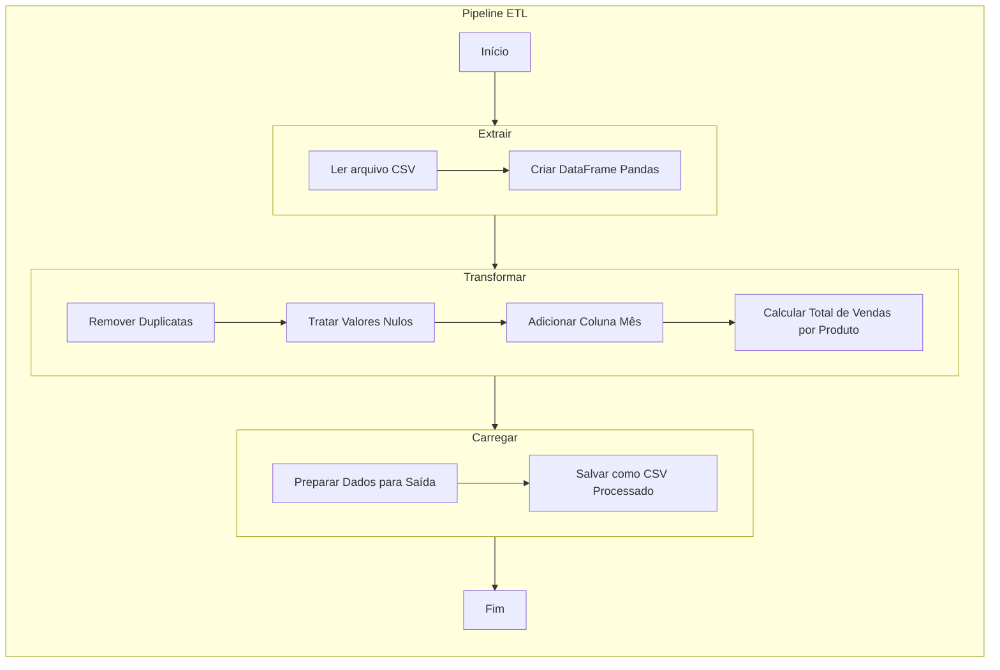

# Aula 04 - Bootcamp de Python com Laennder

Processo ETL Detalhado:



## Objetivos da Aula

Nesta aula, focamos em dois aspectos importantes do desenvolvimento em Python:

1. Criar uma ETL (Extract, Transform, Load) do zero usando Pandas
2. Preparar o projeto para futura integração com AWS S3
3. Revisar Git e GitHub

### 1. ETL com Pandas

Construímos um processo de ETL completo utilizando a biblioteca Pandas, que inclui:

- Extração de dados de um arquivo CSV para um DataFrame do Pandas
- Transformação e limpeza dos dados, incluindo:
  - Remoção de duplicatas
  - Tratamento de valores nulos
  - Adição de uma coluna de mês
  - Cálculo do total de vendas por produto
- Carregamento dos dados processados em um novo arquivo CSV

### 2. Estrutura do Projeto

O projeto foi estruturado da seguinte forma:

```
projeto_etl/
│
├── data/
│ ├── input/
│ │ └── vendas.csv
│ └── output/
│
├── src/
│ └── etl_process.py
│
└── README.md
```

- `data/input/vendas.csv`: Arquivo CSV de exemplo com dados de vendas
- `src/etl_process.py`: Script Python que realiza o processo ETL
- `data/output/`: Diretório onde será salvo o arquivo CSV processado

### 3. Funcionalidades Implementadas

O script `etl_process.py` realiza as seguintes operações:

1. Extrai dados do arquivo CSV de entrada
2. Transforma os dados:
   - Remove duplicatas
   - Trata valores nulos na coluna 'quantidade' e 'valor_total'
   - Adiciona uma coluna 'mes' baseada na data da venda
   - Calcula o total de vendas por produto
3. Carrega os dados transformados em um novo arquivo CSV

### 5. Como instalar e executar o projeto

1. Certifique-se de ter o Python (versão 3.12 ou superior) e o Git instalados em seu sistema.

```bash
python --version
git --version
```  

2. Abra o terminal e clone o repositório:

```bash
git clone https://github.com/lvgalvao/projeto_etl.git
cd projeto_etl
```   

3. Crie um ambiente virtual:

```bash
python -m venv .venv
```

4. Ative o ambiente virtual:

No Windows:

```bash
source .venv\Scripts\activate
```

No macOS e Linux:

```bash
source .venv/bin/activate
```

5. Instale as dependências:

```bash
pip install -r requirements.txt
```

6. Navegue até a pasta src:

```bash
cd projeto_etl
```

7. Execute o script ETL:

```bash
python etl_process.py
```
O script irá processar os dados do arquivo `vendas.csv` e gerar um novo arquivo `vendas_processadas.csv` na pasta `data/output/`.

### 5. Próximos Passos

- Integrar o projeto com AWS S3 para armazenamento em nuvem
- Implementar tratamento de erros e logging
- Criar documentação detalhada das funções

### 6. Testes Unitários

Foram implementados testes unitários para garantir a qualidade e o funcionamento correto do código. Os testes estão localizados no arquivo `test/test_etl_process.py` e cobrem as principais funções do processo ETL.

Para executar os testes, siga estas etapas:

1. Certifique-se de estar no diretório raiz do projeto.

2. Execute o seguinte comando:

```bash
PYTHONPATH=. pytest -v
```

Este comando configura o PYTHONPATH para incluir o diretório atual e executa o pytest com saída detalhada (-v).

Os testes verificam:
- A extração correta de dados de um arquivo CSV
- A transformação adequada dos dados, incluindo tratamento de valores nulos e cálculos
- O carregamento correto dos dados em formatos CSV e Parquet

Executar os testes regularmente ajuda a garantir que as alterações no código não introduzam regressões e que todas as funcionalidades continuem operando conforme esperado.

## Pré-requisitos

- Python instalado (versão 3.12 ou superior)
- Biblioteca Pandas instalada (`pip install pandas`)
- Conta no GitHub
- Git instalado localmente

## Recursos Adicionais

- [Documentação oficial do Pandas](https://pandas.pydata.org/docs/)
- [Guia do GitHub para iniciantes](https://docs.github.com/pt/get-started)

Continuaremos a aprimorar nossas habilidades em manipulação de dados e colaboração em projetos!
